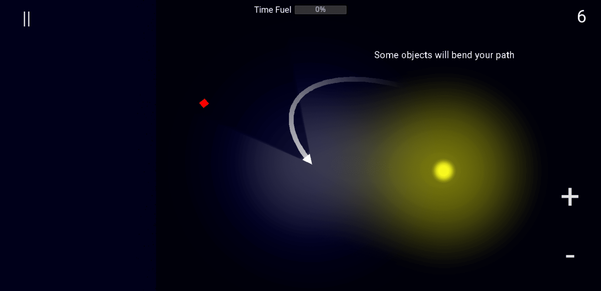

# Gravity

> A prototype game where you steer the player into goals, overcoming gravity and other obstacles. Sort of like golf, in space?



## How to play

Go to: https://harvzor.github.io/gravity-game/

Up to date HTML builds should be pushed to the `html` branch, which is then available via GitHub pages.

> **Note**
> Web performance isn't that great! Build for native if you want the best experience.

## Developing

### Requirements:

- Godot Mono v3.5.stable
- DotNet 6.0.302

### Getting started

- run `dotnet restore`
- open with Godot and build
    - you may need to set `dotnet cli` as the build tool in Godot
        - Editor -> Editor settings -> Mono -> Builds -> Build Tool -> dotnet CLI
    - if you run into an issue such as `The build method threw an exception.` and `Cannot find executable for 'dotnet CLI'. Fallback to MSBuild from Mono.`, this issue may be present: https://github.com/godotengine/godot/issues/38985
        - run Godot from the CLI, then build
- run

## Exporting

### Web

Probably you want to build this so it can be released to GitHub pages...

```
git checkout html
cd ./src
godot --export "HTML5" ../docs/index.html
```

### Android

Follow this guide: https://docs.godotengine.org/en/3.2/getting_started/workflow/export/exporting_for_android.html

Export to APK, then install to connected phone:

```
cd ./src
godot --export-debug "Android" bin/gravity.apk && adb install bin/gravity.apk
```

## Thoughts

### Touch controls

If [this](https://github.com/godotengine/godot/pull/36953) is implemented, I'll be able to setup pinch to zoom controls easily.